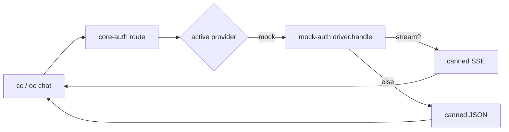

# mock-auth

[](https://www.npmjs.com/package/mock-auth)
[](https://www.npmjs.com/package/mock-auth)
[](https://github.com/intisy/mock-auth/actions/workflows/publish.yml)

A mock AI-provider driver for [`core-auth`](https://github.com/intisy/core-auth). It returns
canned, valid Anthropic Messages API responses (JSON or SSE) so the auth pipeline — discovery,
routing, account selection, and the per-app adapters in Claude Code and OpenCode — can be
validated end to end without contacting any real provider.

## Under-the-Hood Architecture



## Structure

- `src/driver.ts` — the `ProviderDriver`: `handle()` returns the canned response, `authenticate()`
  mints a dummy account, and no `parseQuota` (it never rate-limits).
- `dist/driver.js` — compiled output (the `claudeHub.authProviders[].driver` entry point).

## Installation

### Via plugin-updater (primary)

`mock-auth` is a `core-auth` driver, discovered when it is present in `<configDir>/repos/`. Add it
to either loader's plugin set:

```bash
npx -y plugin-updater@latest add https://github.com/intisy/mock-auth
```

Then open the loader → Plugins → Provider tab (`cc auth` / `oc auth`) and select **Mock**.

### Via npm

```bash
npm install mock-auth
```

## Configuration

`mock-auth` has no settings of its own. The active provider is stored by `core-auth` in
`<configDir>/config/core-auth.json`:

```json
{
  "provider": "mock"
}
```

## Logging

`mock-auth` produces no logs of its own; request routing is logged by `core-auth` under
`<configDir>/logs/YYYY-MM-DD/`.

## License

MIT
